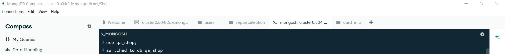
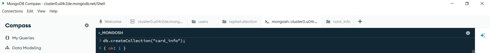
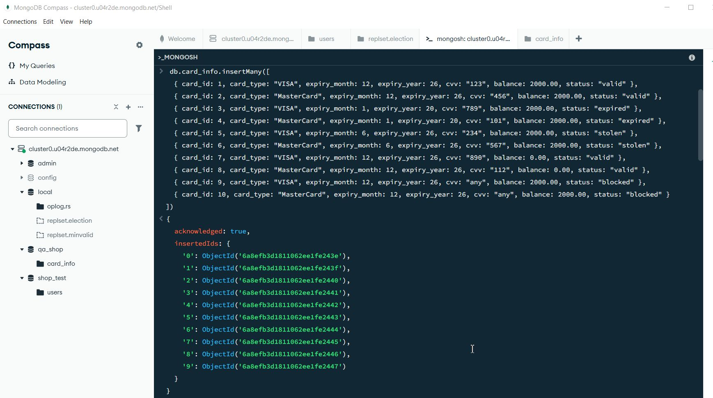
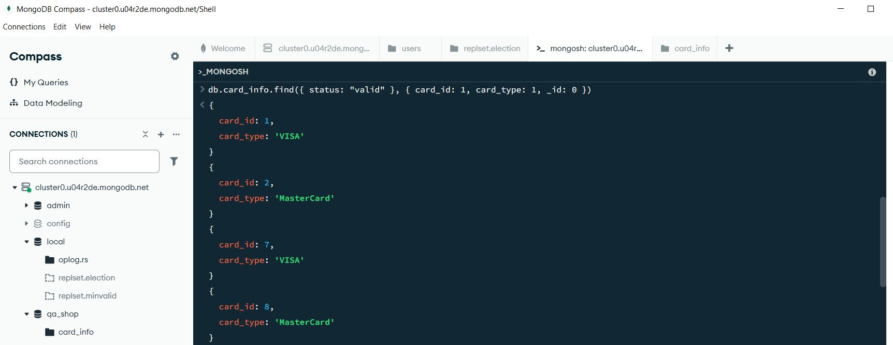
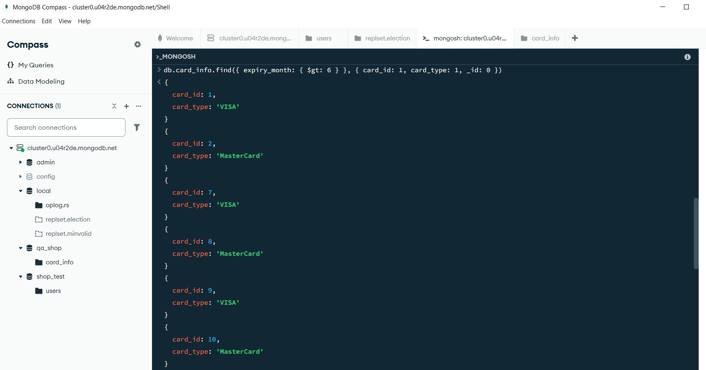
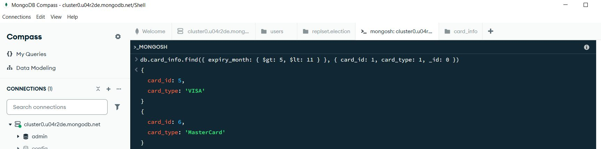
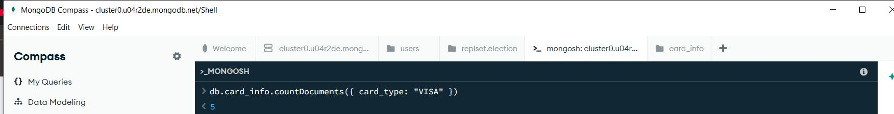
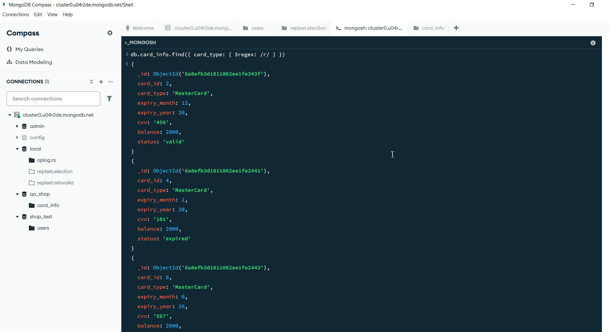
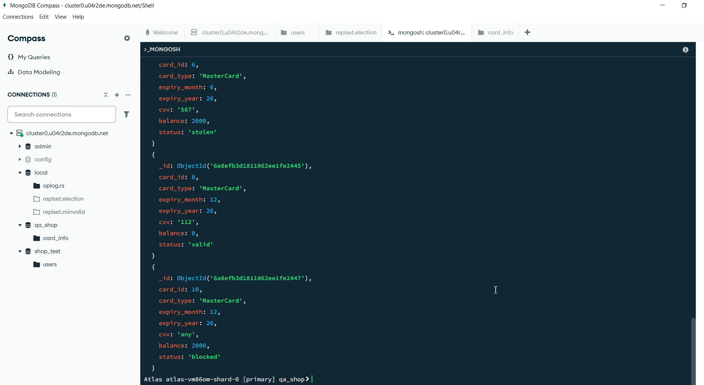

# 🌱 Mongodb
### 🛠️ Инструмент: Mongodb Compass

### **Задание 1:** 
Создайте новую базу данных qa_shop.

**Запрос:**

```javascript
use qa_shop
```
Результат:<br><br>

<br><br><br>

### **Задание 2:** 
Внутри нее создайте коллекцию card_info.

**Запрос:**

```javascript
db.createCollection("card_info");
```
Результат:<br><br>

<br><br><br>

### **Задание 3:** 
Внутри коллекций создайте документы, которые будут повторять информацию из таблицы card_info в MySQL.

**Запрос:**

```javascript
 db.card_info.insertMany([
  { card_id: 1, card_type: "VISA", expiry_month: 12, expiry_year: 26, cvv: "123", balance: 2000.00, status: "valid" },
  { card_id: 2, card_type: "MasterCard", expiry_month: 12, expiry_year: 26, cvv: "456", balance: 2000.00, status: "valid" },
  { card_id: 3, card_type: "VISA", expiry_month: 1, expiry_year: 20, cvv: "789", balance: 2000.00, status: "expired" },
  { card_id: 4, card_type: "MasterCard", expiry_month: 1, expiry_year: 20, cvv: "101", balance: 2000.00, status: "expired" },
  { card_id: 5, card_type: "VISA", expiry_month: 6, expiry_year: 26, cvv: "234", balance: 2000.00, status: "stolen" },
  { card_id: 6, card_type: "MasterCard", expiry_month: 6, expiry_year: 26, cvv: "567", balance: 2000.00, status: "stolen" },
  { card_id: 7, card_type: "VISA", expiry_month: 12, expiry_year: 26, cvv: "890", balance: 0.00, status: "valid" },
  { card_id: 8, card_type: "MasterCard", expiry_month: 12, expiry_year: 26, cvv: "112", balance: 0.00, status: "valid" },
  { card_id: 9, card_type: "VISA", expiry_month: 12, expiry_year: 26, cvv: "any", balance: 2000.00, status: "blocked" },
  { card_id: 10, card_type: "MasterCard", expiry_month: 12, expiry_year: 26, cvv: "any", balance: 2000.00, status: "blocked" }
])
```
Результат:<br><br>

<br><br><br>

### **Задание 4:** 
Выведите все id и card_type со статусами valid.

**Запрос:**

```javascript
db.card_info.find({ status: "valid" }, { card_id: 1, card_type: 1, _id: 0 })
```
Результат:<br><br>

<br><br><br>

### **Задание 5:** 
Выведите все id и card_type, у которых expiry_month больше 6.

**Запрос:**

```javascript
db.card_info.find({ expiry_month: { $gt: 6 } }, { card_id: 1, card_type: 1, _id: 0 })
```
Результат:<br><br>

<br><br><br>

### **Задание 6:** 
Выведите все id и card_type, у которых expiry_month больше 5 и меньше 11.

**Запрос:**

```javascript
db.card_info.find({ expiry_month: { $gt: 5, $lt: 11 } }, { card_id: 1, card_type: 1, _id: 0 })
```
Результат:<br><br>

<br><br><br>

### **Задание 7:** 
Посчитайте общее количество карт с card_type = VISA.

**Запрос:**

```javascript
db.card_info.countDocuments({ card_type: "VISA" })
```
Результат:<br><br>

<br><br><br>

### **Задание 8:** 
Выведите всю информацию о карточках, в названиях которых содержится буква r.

**Запрос:**

```javascript
db.card_info.find({ card_type: { $regex: /r/ }})
```
Результат:<br><br>


<br><br><br>
