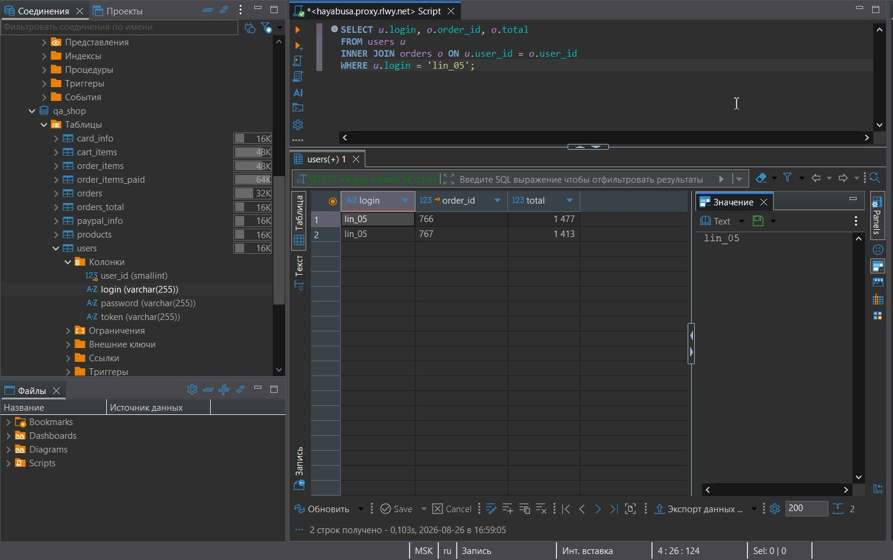
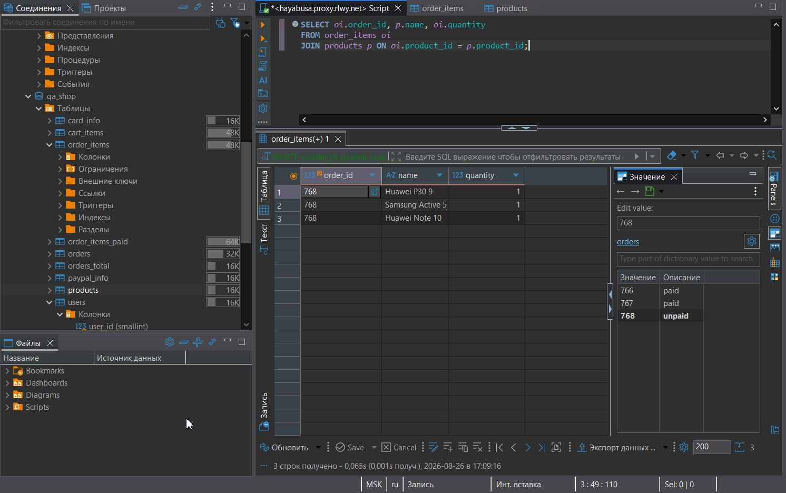
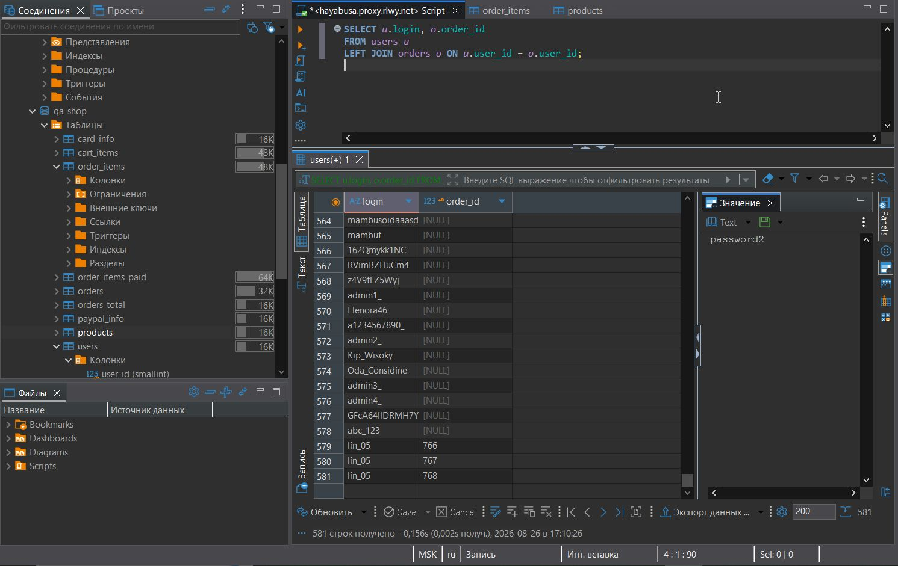
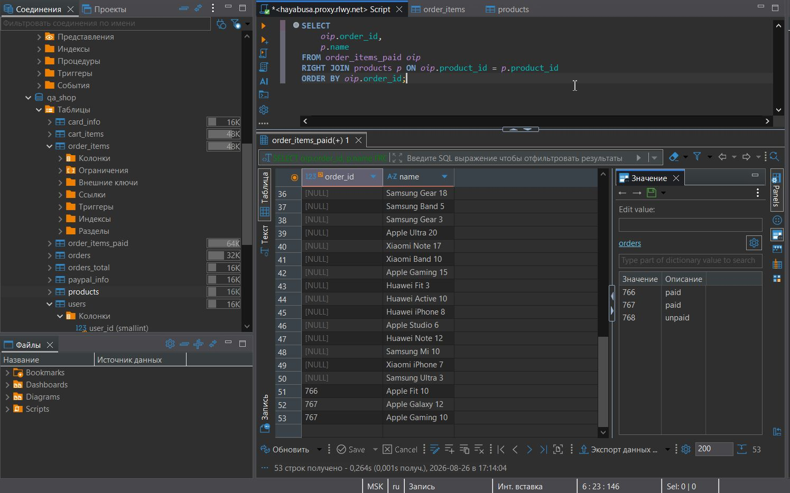
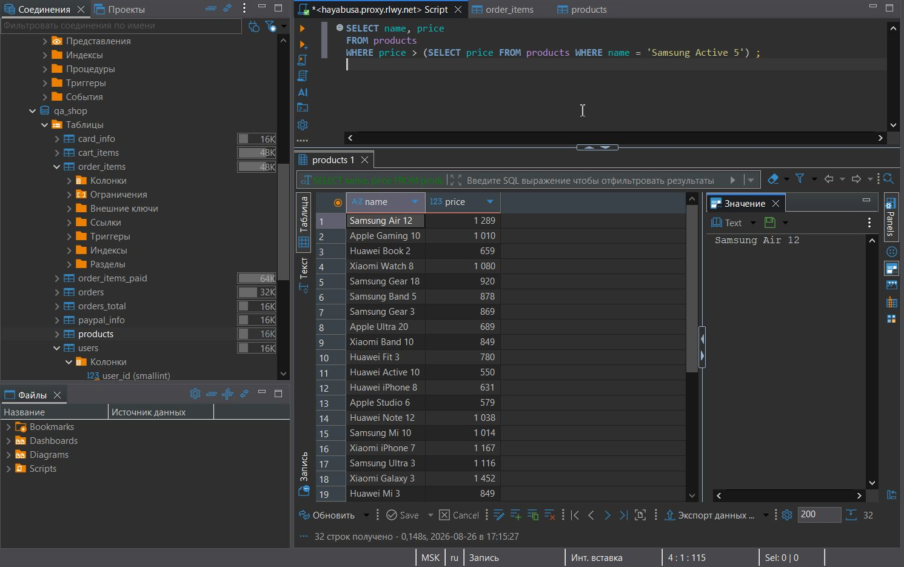

# 🐬 MySQL
### 🛠️ Инструмент: DBeaver

## JOIN-запросы

### **Задание 1:** 
Выведите логин вашего пользователя, номера его заказов и их стоимость (таблицы users и orders).

**Запрос:**

```sql
SELECT u.login, o.order_id, o.total 
FROM users u
INNER JOIN orders o ON u.user_id = o.user_id 
WHERE u.login = 'lin_05';
```
Результат:<br><br>

<br><br><br>

### **Задание 2:** 
Выведите номера всех заказов, названия товаров в них и их количество (таблицы order_items и products).

**Запрос:**

```sql 	
SELECT oi.order_id, p.name, oi.quantity
FROM order_items oi
JOIN products p ON oi.product_id = p.product_id;
```
Результат:<br><br>

<br><br><br>

### **Задание 3:** 
Выведите логины всех пользователей и номера заказов, вне зависимоcти от того, есть ли у них заказ или нет (таблицы users и orders).

**Запрос:**

```sql 	
SELECT u.login, o.order_id 
FROM users u 
LEFT JOIN orders o ON u.user_id = o.user_id;
```
Результат:<br><br>

<br><br><br>

### **Задание 4:** 
Выведите номера оплаченных заказов и название всех товаров, вне зависимоcти от того, упоминаются ли товары в оплаченных заказах (таблицы products и order_items_paid).

**Запрос:**

```sql 	
SELECT 
    oip.order_id, 
    p.name
FROM order_items_paid oip
RIGHT JOIN products p ON oip.product_id = p.product_id
ORDER BY oip.order_id;
```
Результат:<br><br>

<br><br><br>

### **Задание 5:** 
Используя вложенный запрос выведите названия и стоимость товаров, у которых стоимость товара больше, чем стоимость товара "Samsung Active 5" из таблицы products.

**Запрос:**

```sql 	
SELECT name, price 
FROM products 
WHERE price > (SELECT price FROM products WHERE name = 'Samsung Active 5');
```
Результат:<br><br>

<br><br><br>
