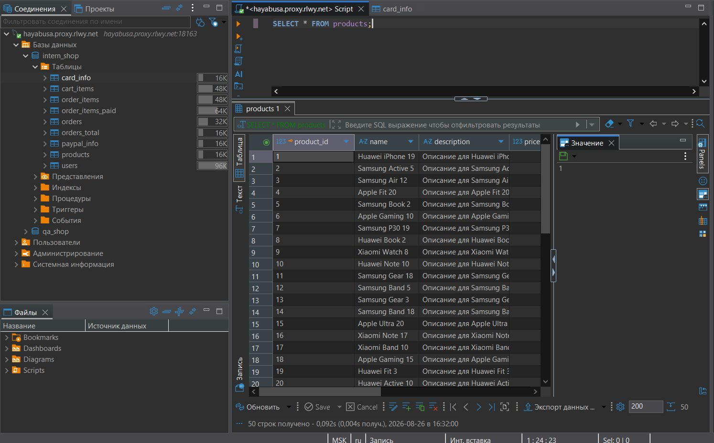
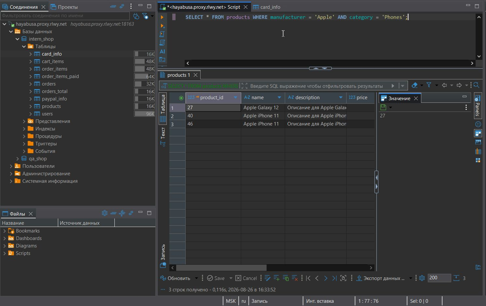
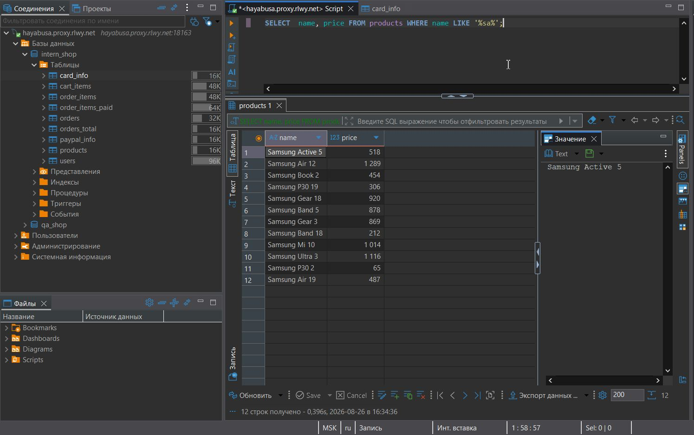
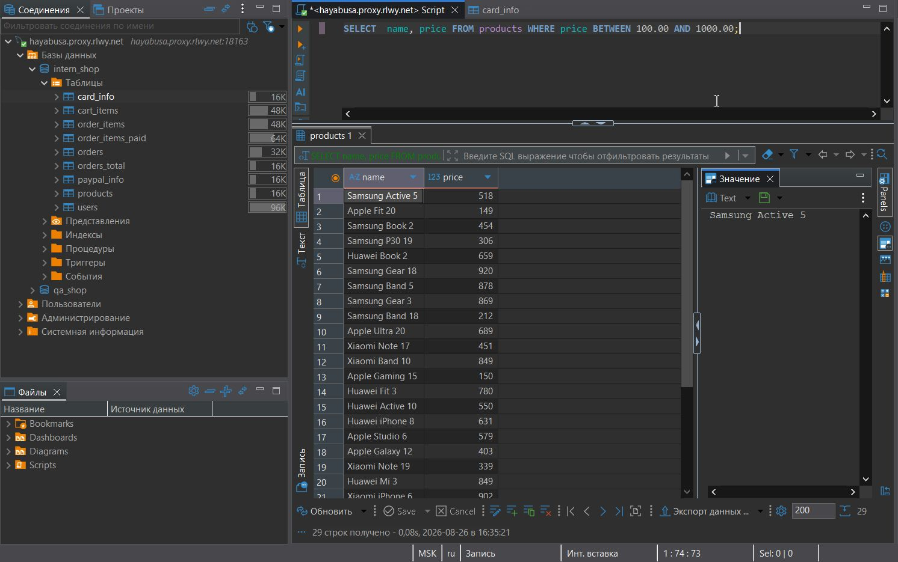
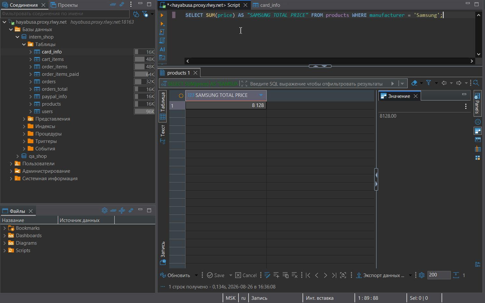
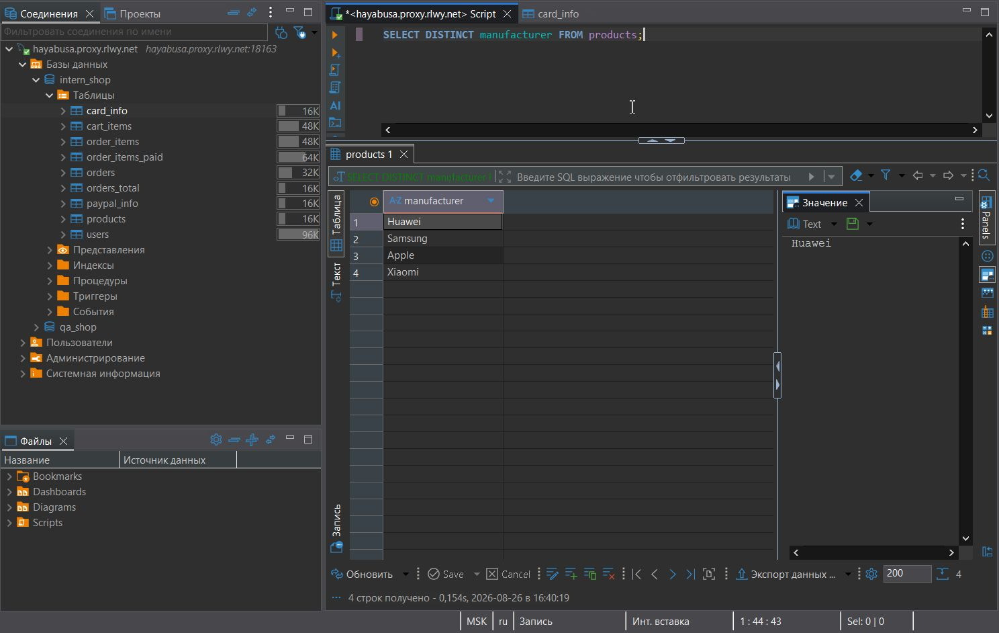
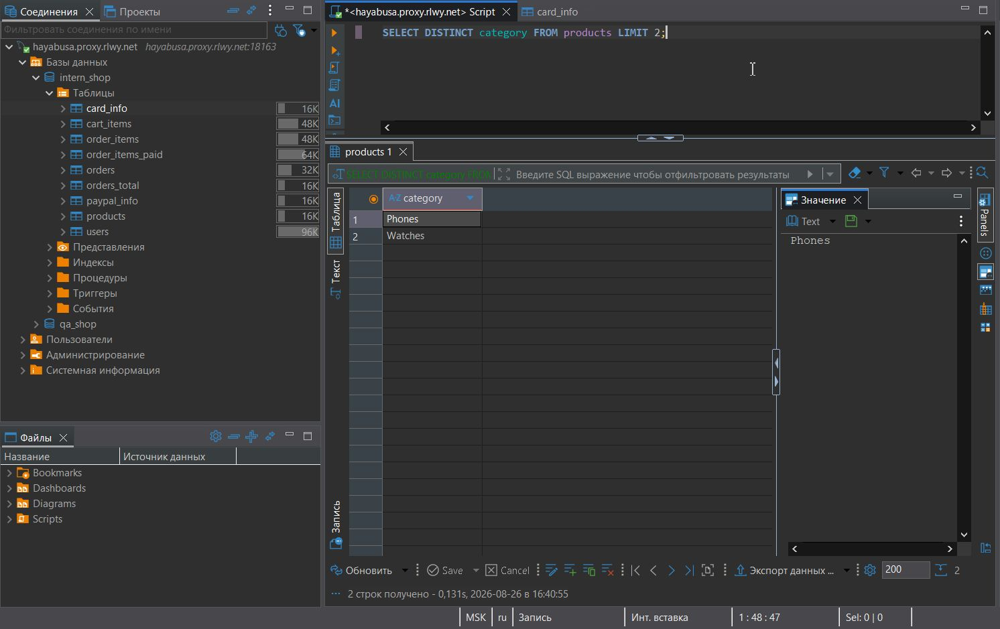
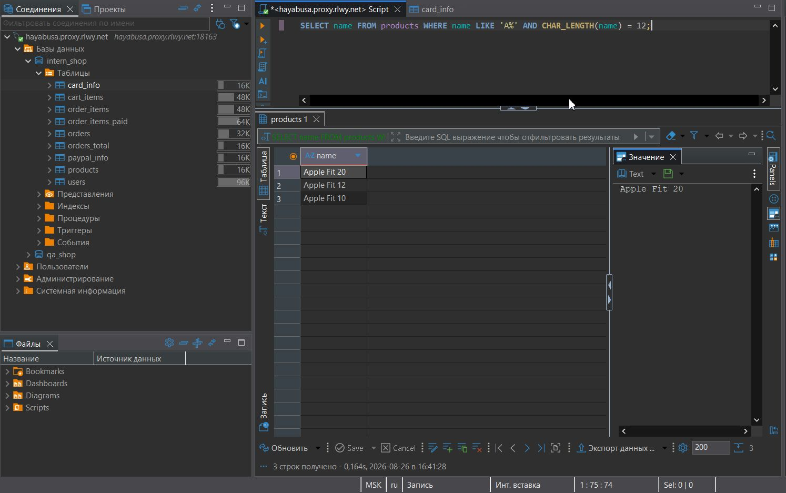
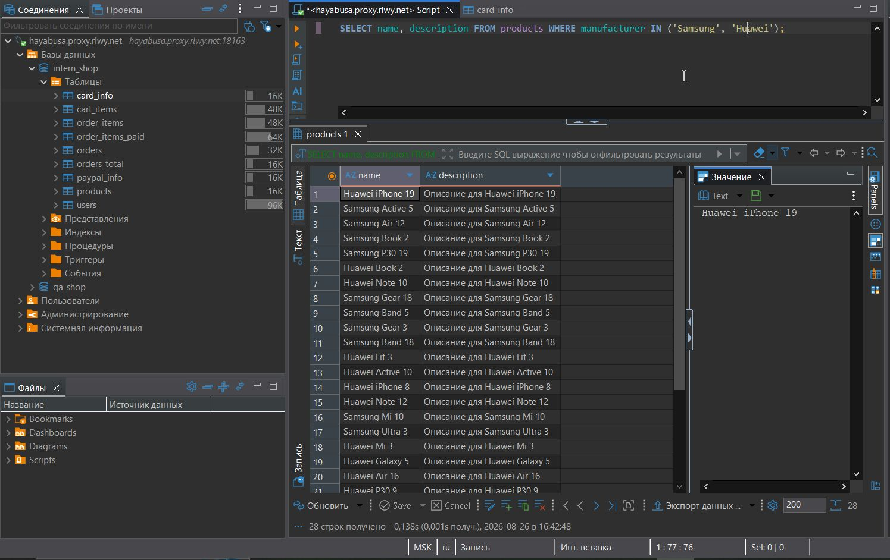
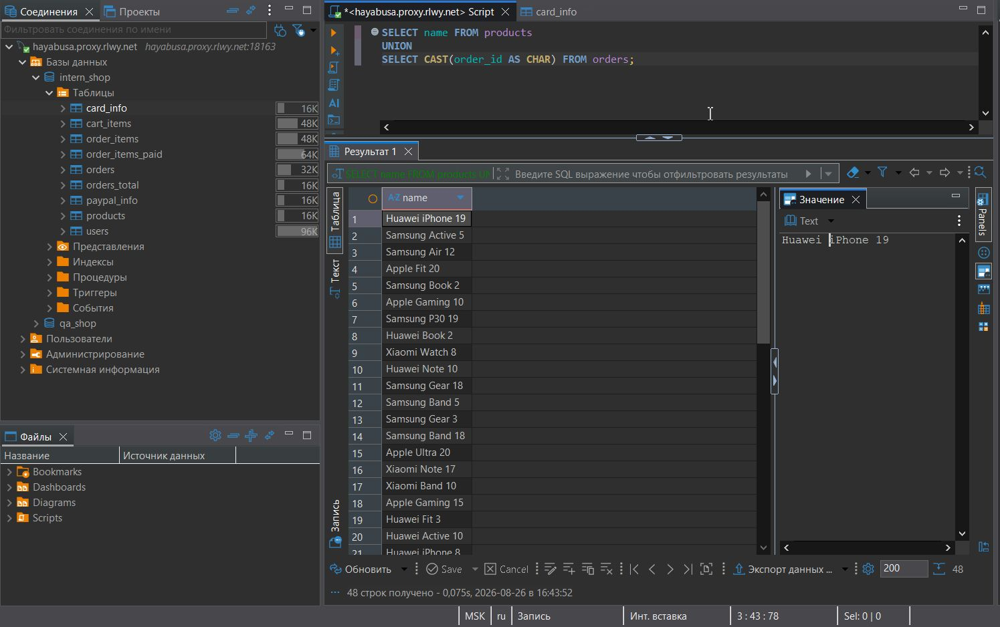

# 🐬 MySQL
### 🛠️ Инструмент: DBeaver

## SELECT-запросы

### **Задание 1:** 
Выведите информацию обо всех продуктах.

**Запрос:**

```sql
SELECT * FROM products;
```
Результат:<br><br>

<br><br><br>

### **Задание 2:** 
Выведите информацию обо всех продуктах, произведенных Apple в категории Phones.

**Запрос:**

```sql
SELECT * FROM products
WHERE manufacturer = 'Apple' AND category = 'Phones';
```
Результат:<br><br>

<br><br><br>

### **Задание 3:** 
Выведите названия продуктов и их стоимость, при условии что в названии содержатся буквы sa в любом месте.

**Запрос:**

```sql
SELECT  name, price FROM products
WHERE name LIKE '%sa%';
```
Результат:<br><br>

<br><br><br>

### **Задание 4:** 
Выведите названия продуктов и их стоимость, при условии того, что цена находится в диапазоне от 100 до 1000 долларов.

**Запрос:**

```sql
SELECT  name, price FROM products
WHERE price BETWEEN 100.00 AND 1000.00;
```
Результат:<br><br>

<br><br><br>

### **Задание 5:** 
Посчитайте сумму всех товаров, произведенных компанией Samsung. Название таблицы в результате запроса должно быть SAMSUNG TOTAL PRICE.

**Запрос:**

```sql
SELECT SUM(price) AS "SAMSUNG TOTAL PRICE"
FROM products
WHERE manufacturer = 'Samsung';
```
Результат:<br><br>

<br><br><br>

### **Задание 6:** 
Выведите название всех товаров и их стоимость по убыванию.

**Запрос:**

```sql
SELECT name, price FROM products
ORDER BY price DESC;
```
Результат:<br><br>

<br><br><br>

### **Задание 7:** 
Выведите названия всех производителей при условии, чтобы они не повторялись.

**Запрос:**

```sql
SELECT DISTINCT manufacturer FROM products;
```
Результат:<br><br>

<br><br><br>

### **Задание 8:** 
Выведите названия первых двух категорий продуктов, чтобы они не повторялись.

**Запрос:**

```sql
SELECT DISTINCT category FROM products LIMIT 2;
```
Результат:<br><br>

<br><br><br>

### **Задание 9:** 
Выведите названия продуктов при условии, что они состоят из 12 символов и их названия начинаются с A.

**Запрос:**

```sql
SELECT name FROM products
WHERE name LIKE 'A%' AND CHAR_LENGTH(name) = 12;
```
Результат:<br><br>

<br><br><br>

### **Задание 10:** 
Посчитайте среднюю цену всех продуктов. Название таблицы в результате запроса должно быть PRODUCTS AVG PRICE.

**Запрос:**

```sql
SELECT avg(price) AS "PRODUCTS AVG PRICE"
FROM products;
```
Результат:<br><br>

<br><br><br>

### **Задание 11:** 
Используя оператор IN, выведите названия и описание продуктов, у которых производитель Samsung и Huawei.

**Запрос:**

```sql
SELECT name, description FROM products
WHERE manufacturer IN ('Samsung', 'Huawei');
```
Результат:<br><br>

<br><br><br>

### **Задание 12:** 
Используя оператор UNION, выведите информацию о названии товаров из таблицы products и номера заказов из таблицы orders.

**Запрос:**

```sql
SELECT name FROM products 
UNION 
SELECT CAST(order_id AS CHAR) FROM orders;
```
Результат:<br><br>

<br><br><br>
